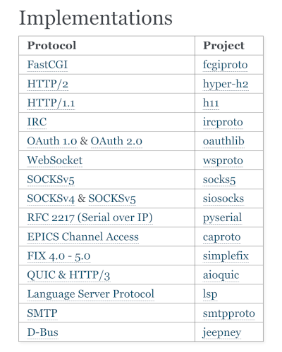

# pytest-automock and sans-io approach

---

# pytest-automock example

---

# pytest-automock example

#
    $ tree pytest-automock-example/
    pytest-automock-example/
    ├── mymod.py
    ├── conftest.py
    └── test_logic.py

---

# pytest-automock example

#
    !python
    # mymod.py
    import time

    def get_data_from_network(x, y):
        time.sleep(1)
        return x + y

    def logic(x):
        a, b = 0, 1
        while b < x:
            c = get_data_from_network(a, b)
            a, b = b, c
        return b

---

# pytest-automock example

#
    !python
    # mymod.py
    import time

    def get_data_from_network(x, y):
        time.sleep(1)
        return x + y

    def logic(x):
        a, b = 0, 1
        while b < x:
            c = get_data_from_network(a, b)
            a, b = b, c
        return b

#
    !python
    # conftest.py
    import pytest

    @pytest.fixture(autouse=True)
    def _mocks(automock):
        with automock("mymod.get_data_from_network", storage="mocks"):
            yield

---

# pytest-automock example

#
    !python
    # conftest.py
    import pytest

    @pytest.fixture(autouse=True)
    def _mocks(automock):
        with automock("mymod.get_data_from_network", storage="mocks"):
            yield

#
    !python
    # test_logic.py
    from mymod import logic

    def test_logic():
        assert logic(7) == 8
        assert logic(10) == 13

---

# pytest-automock example

#
    !python
    # conftest.py
    import pytest

    @pytest.fixture(autouse=True)
    def _mocks(automock):
        with automock("mymod.get_data_from_network", storage="mocks"):
            yield

#
    !python
    # test_logic.py
    from mymod import logic

    def test_logic():
        assert logic(7) == 8
        assert logic(10) == 13

#
    $ pytest

---

# pytest-automock example

#
    !python
    # conftest.py
    import pytest

    @pytest.fixture(autouse=True)
    def _mocks(automock):
        with automock("mymod.get_data_from_network", storage="mocks"):
            yield

#
    !python
    # test_logic.py
    from mymod import logic

    def test_logic():
        assert logic(7) == 8
        assert logic(10) == 13

#
    $ pytest
    ...
    E           AutoMockException: Mock is locked, but Call(...) wanted
    ...
    1 error in 0.09s

---

# pytest-automock example

#
    !python
    # conftest.py
    import pytest

    @pytest.fixture(autouse=True)
    def _mocks(automock):
        with automock("mymod.get_data_from_network", storage="mocks"):
            yield

#
    !python
    # test_logic.py
    from mymod import logic

    def test_logic():
        assert logic(7) == 8
        assert logic(10) == 13

#
    $ pytest --automock-unlocked
    ...
    test_logic.py .
    ...
    1 passed in 11.02s

---

# pytest-automock example

#
    !python
    # conftest.py
    import pytest

    @pytest.fixture(autouse=True)
    def _mocks(automock):
        with automock("mymod.get_data_from_network", storage="mocks"):
            yield

#
    !python
    # test_logic.py
    from mymod import logic

    def test_logic():
        assert logic(7) == 8
        assert logic(10) == 13

#
    $ tree mocks
    mocks
    └── test_logic
        └── mymod
            └── get_data_from_network

---

# pytest-automock example

#
    !python
    # conftest.py
    import pytest

    @pytest.fixture(autouse=True)
    def _mocks(automock):
        with automock("mymod.get_data_from_network", storage="mocks"):
            yield

#
    !python
    # test_logic.py
    from mymod import logic

    def test_logic():
        assert logic(7) == 8
        assert logic(10) == 13

#
    $ pytest
    ...
    test_logic.py .
    ...
    1 passed in 0.01s

---

# pytest-automock pros and cons

---

# pytest-automock pros and cons

## Pros:
- speed up your tests

---

# pytest-automock pros and cons

## Pros:
- speed up your tests
- reproducible tests

---

# pytest-automock pros and cons

## Pros:
- speed up your tests
- reproducible tests
- pytest plugin

---

# pytest-automock pros and cons

## Pros:
- speed up your tests
- reproducible tests
- pytest plugin
- sync and async support, customizable serialization, etc.

---

# pytest-automock pros and cons

## Pros:
- speed up your tests
- reproducible tests
- pytest plugin
- sync and async support, customizable serialization, etc.

## Cons:
- no support for dunder methods (no context managers, no magic methods, etc.)

---

# pytest-automock pros and cons

## Pros:
- speed up your tests
- reproducible tests
- pytest plugin
- sync and async support, customizable serialization, etc.

## Cons:
- no support for dunder methods (no context managers, no magic methods, etc.)
- races can break tests, since order counts

---

# pytest-automock pros and cons

## Pros:
- speed up your tests
- reproducible tests
- pytest plugin
- sync and async support, customizable serialization, etc.

## Cons:
- no support for dunder methods (no context managers, no magic methods, etc.)
- races can break tests, since order counts
- non-determenistic representation will break tests (e.g. `datetime.now()`)

---

# pytest-automock pros and cons

## Pros:
- speed up your tests
- reproducible tests
- pytest plugin
- sync and async support, customizable serialization, etc.

## Cons:
- no support for dunder methods (no context managers, no magic methods, etc.)
- races can break tests, since order counts
- non-determenistic representation will break tests (e.g. `datetime.now()`)
- arguments and results/exceptions must be serializable

---

# pytest-automock pros and cons

## Pros:
- speed up your tests
- reproducible tests
- pytest plugin
- sync and async support, customizable serialization, etc.

## Cons:
- no support for dunder methods (no context managers, no magic methods, etc.)
- races can break tests, since order counts
- non-determenistic representation will break tests (e.g. `datetime.now()`)
- arguments and results/exceptions must be serializable
- project should be written with pytest-automock in mind

---

# sans-io

---

# sans-io

---

# sans-io

## classic stack

---

# sans-io

## classic stack
`logic proivder`

---

# sans-io

## classic stack
`logic proivder` → `data provider`

---

# sans-io

## classic stack
`logic proivder` → `data provider` → `IO`

---

# sans-io

## classic stack
`logic proivder` → `data provider` → **`IO`**

---

# sans-io

## classic stack
`logic proivder` → `data provider` → **`IO`**

- testing/mocking `IO` is hard

---

# sans-io

## classic stack
`logic proivder` → `data provider` → **`IO`**

- testing/mocking `IO` is hard
- `IO` exceptions handling

---

# sans-io

## classic stack
`logic proivder` → `data provider` → **`IO`**

- testing/mocking `IO` is hard
- `IO` exceptions handling
- multiple `IO` calls in different parts of code

---

# sans-io

## classic stack
`logic proivder` → `data provider` → **`IO`**

- testing/mocking `IO` is hard
- `IO` exceptions handling
- multiple `IO` calls in different parts of code
- sync/async compatibility

---

# sans-io

## classic stack
`logic proivder` → `data provider` → **`IO`**

- testing/mocking `IO` is hard
- `IO` exceptions handling
- multiple `IO` calls in different parts of code
- sync/async compatibility

## sans-io stack

---

# sans-io

## classic stack
`logic proivder` → `data provider` → **`IO`**

- testing/mocking `IO` is hard
- `IO` exceptions handling
- multiple `IO` calls in different parts of code
- sync/async compatibility

## sans-io stack
`IO`

---

# sans-io

## classic stack
`logic proivder` → `data provider` → **`IO`**

- testing/mocking `IO` is hard
- `IO` exceptions handling
- multiple `IO` calls in different parts of code
- sync/async compatibility

## sans-io stack
`IO` → `data provider`

---

# sans-io

## classic stack
`logic proivder` → `data provider` → **`IO`**

- testing/mocking `IO` is hard
- `IO` exceptions handling
- multiple `IO` calls in different parts of code
- sync/async compatibility

## sans-io stack
`IO` → `data provider` → `logic proivder`

---

# sans-io

## classic stack
`logic proivder` → `data provider` → **`IO`**

- testing/mocking `IO` is hard
- `IO` exceptions handling
- multiple `IO` calls in different parts of code
- sync/async compatibility

## sans-io stack
**`IO`** → `data provider` → `logic proivder`

---

# sans-io

## classic stack
`logic proivder` → `data provider` → **`IO`**

- testing/mocking `IO` is hard
- `IO` exceptions handling
- multiple `IO` calls in different parts of code
- sync/async compatibility

## sans-io stack
**`IO`** → `data provider` → `logic proivder`

# FRAMEWORKS?!

---

# sans-io

## classic stack
`logic proivder` → `data provider` → **`IO`**

- testing/mocking `IO` is hard
- `IO` exceptions handling
- multiple `IO` calls in different parts of code
- sync/async compatibility

## sans-io stack
**`IO`** → `data provider` → `logic proivder`

# FRAMEWORKS?!

**`IO`** → `data provider` → `logic proivder` → `data provider` → **`IO`**

---

# sans-io

## classic stack
`logic proivder` → `data provider` → **`IO`**

- testing/mocking `IO` is hard
- `IO` exceptions handling
- multiple `IO` calls in different parts of code
- sync/async compatibility

## sans-io stack
**`IO`** → `data provider` → `logic proivder`

- `data provider` and `logic proivder` tests are fast

---

# sans-io

## classic stack
`logic proivder` → `data provider` → **`IO`**

- testing/mocking `IO` is hard
- `IO` exceptions handling
- multiple `IO` calls in different parts of code
- sync/async compatibility

## sans-io stack
**`IO`** → `data provider` → `logic proivder`

- `data provider` and `logic proivder` tests are fast
- `IO` tests are simplified

---

# sans-io

## classic stack
`logic proivder` → `data provider` → **`IO`**

- testing/mocking `IO` is hard
- `IO` exceptions handling
- multiple `IO` calls in different parts of code
- sync/async compatibility

## sans-io stack
**`IO`** → `data provider` → `logic proivder`

- `data provider` and `logic proivder` tests are fast
- `IO` tests are simplified
- single point of `IO` exceptions

---

# sans-io

## classic stack
`logic proivder` → `data provider` → **`IO`**

- testing/mocking `IO` is hard
- `IO` exceptions handling
- multiple `IO` calls in different parts of code
- sync/async compatibility

## sans-io stack
**`IO`** → `data provider` → `logic proivder`

- `data provider` and `logic proivder` tests are fast
- `IO` tests are simplified
- single point of `IO` exceptions
- sync/async agnostic

---

# sans-io socks server example

---

# sans-io socks server example
- `read` from client

---

# sans-io socks server example
- `read` from client
- `write` to client

---

# sans-io socks server example
- `read` from client
- `write` to client
- `create_connection` to remote server

---

# sans-io socks server example
- `read` from client
- `write` to client
- `create_connection` to remote server
- `passthrough` from client to remote server

---

# sans-io socks server example
- `read` from client
- `write` to client
- `create_connection` to remote server
- `passthrough` from client to remote server

**`IO`** → `protocol`

---

# sans-io socks server example
- `read` from client
- `write` to client
- `create_connection` to remote server
- `passthrough` from client to remote server

`IO` → `protocol.connection_made()` → `Read(1)`

---

# sans-io socks server example
- `read` from client
- `write` to client
- `create_connection` to remote server
- `passthrough` from client to remote server

`IO` → `protocol.connection_made()` → `Read(1)`

`IO` → `protocol.data_received(b"\x00")` → `Write(b"\x00")`

---

# sans-io socks server example
- `read` from client
- `write` to client
- `create_connection` to remote server
- `passthrough` from client to remote server

`IO` → `protocol.connection_made()` → `Read(1)`

`IO` → `protocol.data_received(b"\x00")` → `Write(b"\x00")`

...

---

# sans-io socks server example
- `read` from client
- `write` to client
- `create_connection` to remote server
- `passthrough` from client to remote server

**`IO`** → `protocol` (**`generators stack`**)

---

# sans-io socks server example
- `read` from client
- `write` to client
- `create_connection` to remote server
- `passthrough` from client to remote server

**`IO`** → `protocol` (**`generators stack`**) (`yield`, `yield from`, `return`)

---

# sans-io socks server example
- `read` from client
- `write` to client
- `create_connection` to remote server
- `passthrough` from client to remote server

**`IO`** → `protocol` (**`generators stack`**) (`yield`, `yield from`, `return`)

#
    !python
    def read(n):
        return yield Read(n)

---

# sans-io socks server example
- `read` from client
- `write` to client
- `create_connection` to remote server
- `passthrough` from client to remote server

**`IO`** → `protocol` (**`generators stack`**) (`yield`, `yield from`, `return`)

#
    !python
    def read(n):
        return yield Read(n)

    def readline():
        data = []
        while True:
            ch = yield from read(1)
            if ch == b"\n":
                return b"".join(data)
            data.append(ch)

---

# sans-io socks server example
- `read` from client
- `write` to client
- `create_connection` to remote server
- `passthrough` from client to remote server

**`IO`** → `protocol` (**`generators stack`**) (`yield`, `yield from`, `return`)

#
    !python
    def read(n):
        return yield Read(n)

    def readline():
        data = []
        while True:
            ch = yield from read(1)
            if ch == b"\n":
                return b"".join(data)
            data.append(ch)

    def protocol():
        line = yield from readline()

---

# sans-io socks server example
- `read` from client
- `write` to client
- `create_connection` to remote server
- `passthrough` from client to remote server

**`IO`** → `protocol` (**`generators stack`**) (`yield`, `yield from`, `return`)

- **IO generator primitives** which `yields`'s **IO** commands

---

# sans-io socks server example
- `read` from client
- `write` to client
- `create_connection` to remote server
- `passthrough` from client to remote server

**`IO`** → `protocol` (**`generators stack`**) (`yield`, `yield from`, `return`)

- **IO generator primitives** which `yields`'s **IO** commands
- **protocol** which `yields from` **IO generator primitives**

---

# sans-io socks server example
- `read` from client
- `write` to client
- `create_connection` to remote server
- `passthrough` from client to remote server

**`IO`** → `protocol` (**`generators stack`**) (`yield`, `yield from`, `return`)

- **IO generator primitives** which `yields`'s **IO** commands
- **protocol** which `yields from` **IO generator primitives**
- **IO** which dispatch commands and send events back to **protocol**

---

# sans-io socks server example
- `read` from client
- `write` to client
- `create_connection` to remote server
- `passthrough` from client to remote server

**`IO`** → `protocol` (**`generators stack`**) (`yield`, `yield from`, `return`)

- **IO generator primitives** which `yields`'s **IO** commands
- **protocol** which `yields from` **IO generator primitives**
- **IO** which dispatch commands and send events back to **protocol**

1 hour live coding https://youtu.be/qLpWl5HWu3E

---

# Conclusion

---

# Conclusion
- there is no «silver bullet» 😔

---

# Conclusion
- there is no «silver bullet» 😔
- both approaches force you to write code in a certain way to take benefits

---

# Conclusion
- there is no «silver bullet» 😔
- both approaches force you to write code in a certain way to take benefits
- testing/mocking `IO` is hard

---

# Questions?
